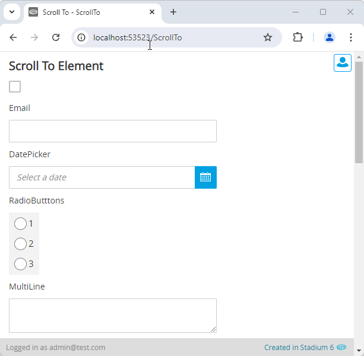

# ScrollTo

Sometimes we may want to scroll the page to the top or to a specific control. 



# Version
Initial 1.0

# Setup

## Application Setup
1. Check the *Enable Style Sheet* checkbox in the application properties

## Global Script
1. Create a Global Script called "ScrollTo"
2. Add the input parameters below to the Global Script
   1. classname
3. Drag a *JavaScript* action into the script
4. Add the Javascript below into the JavaScript code property
```javascript
/* Stadium Script v1.0 https://github.com/stadium-software/scroll-to */
let controlClass = ~.Parameters.Input.classname;
if (controlClass == "top") {
    window.scrollTo({top: 0, behavior: 'smooth'});
} else {
    let el = document.querySelector("." + controlClass);
    if (el) el.scrollIntoView({ behavior: "smooth" });
}
```

## Page
1. Add a unique class to the classes property of a control to wish to scroll to

## Event Handler
1. Drag the "ScrollTo" global script into an event handler 
2. Add the classname of the control you want to scroll to into the script *classname* property
3. To scroll all the way to the top of the page, add "top" into the classname property